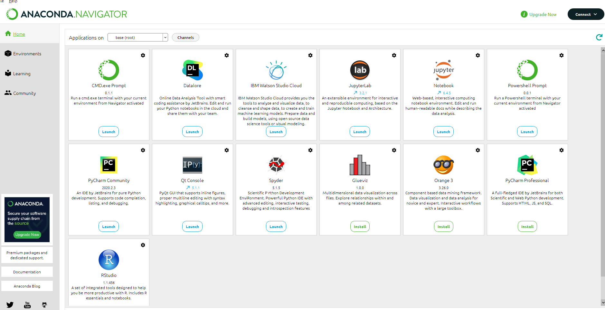

```python
print("hello word!!!")
```

    hello word!!!

实验一


Jupyter NoteBook的安装
1.在官网https://www.anaconda.com/products/distribution点击下载


2.完成下载之后，双击下载文件，启动安装程序。
注意：
① 如果在安装过程中遇到任何问题，那么暂时地关闭杀毒软件，并在安装程序完成之后再打开。

② 如果在安装时选择了“为所有用户安装”，则卸载Anaconda然后重新安装，只为“我这个用户”安装。
3.选择"next"。

4. 阅读许可证协议条款，然后勾选“I Agree”并进行下一步。
5. 除非是以管理员身份为所有用户安装，否则仅勾选“Just Me”并点击“Next”。
6. 在“Choose Install Location”界面中选择安装Anaconda的目标路径，然后点击“Next”。
   注意：
   ① 目标路径中不能含有空格，同时不能是“unicode”编码。

② 除非被要求以管理员权限安装，否则不要以管理员身份安装。

7.一直点next就可以了


8.验证是否安装成功

① “开始 → Anaconda3（64-bit）→ Anaconda Navigator”，若可以成功启动Anaconda Navigator则说明安装成功。

② “开始 → Anaconda3（64-bit）→ 右键点击Anaconda Prompt → 以管理员身份运行”，在Anaconda Prompt中输入 conda list ，可以查看已经安装的包名和版本号。若结果可以正常显示，则说明安装成功。

9在安装成功后点击界面中的Notebook就可以跳转到http://localhost:8888/tree#notebooks

10可以new一个python就可以开始写代码了


