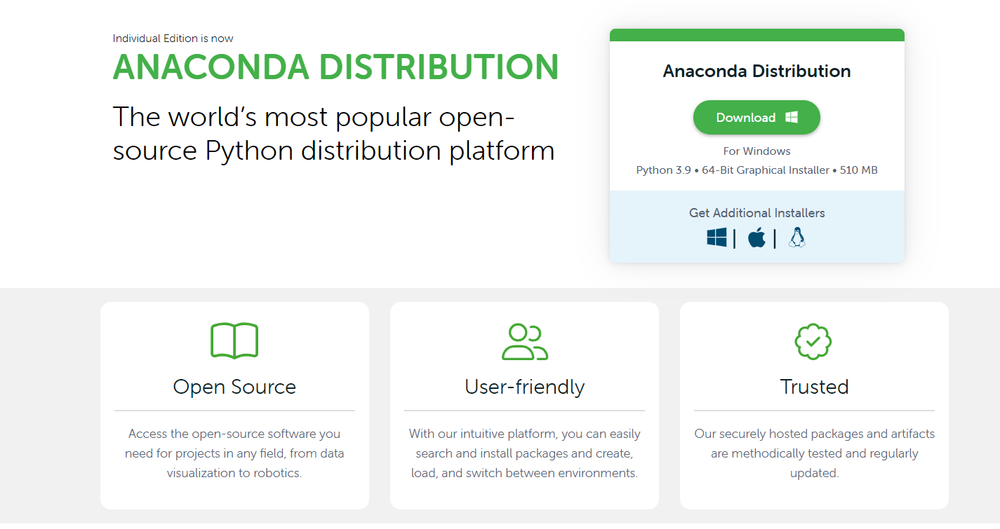
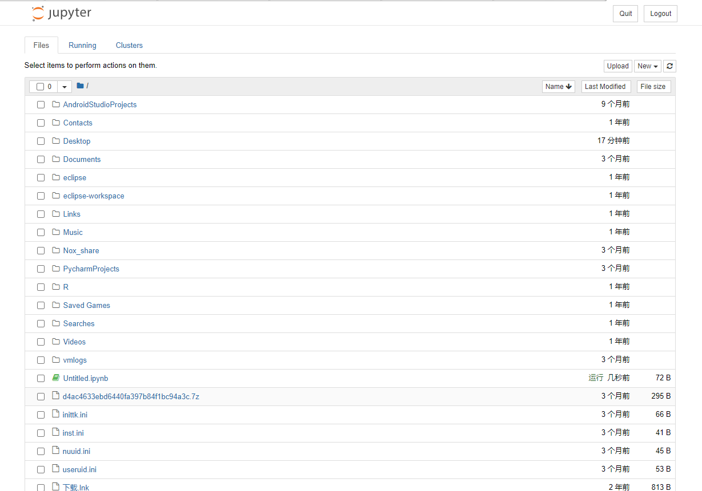
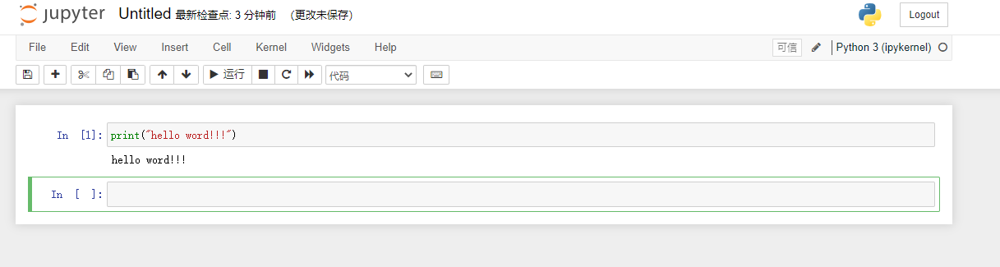
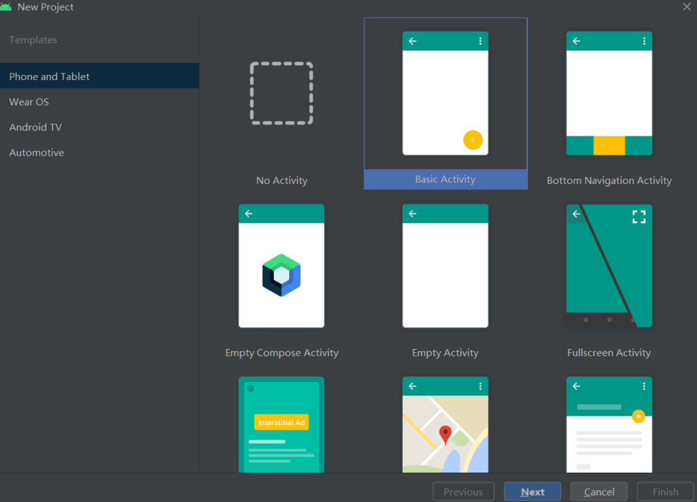
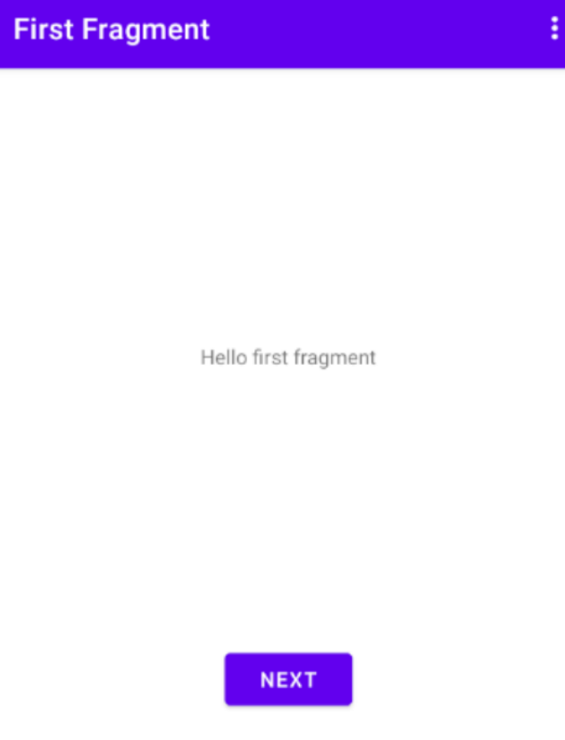
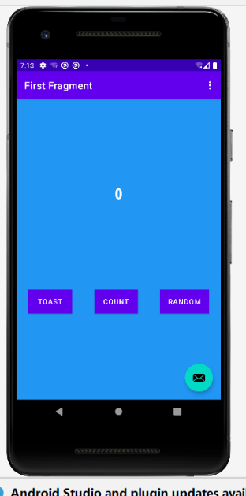
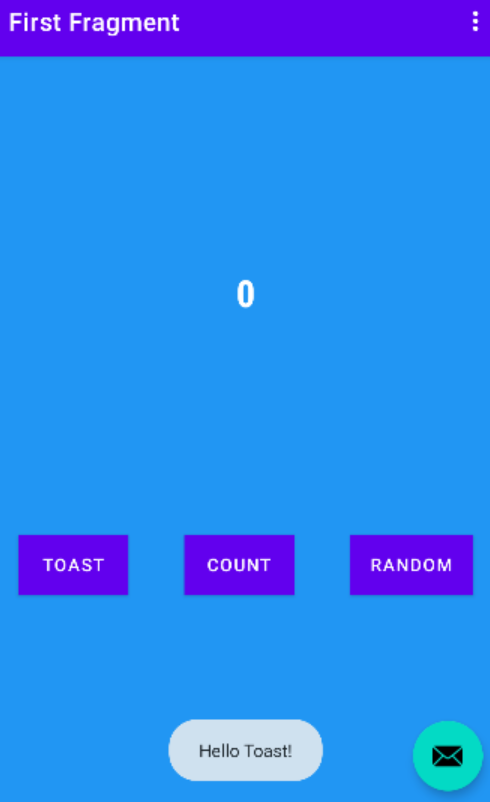
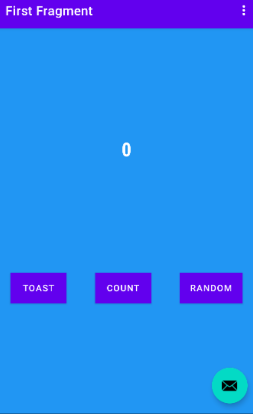
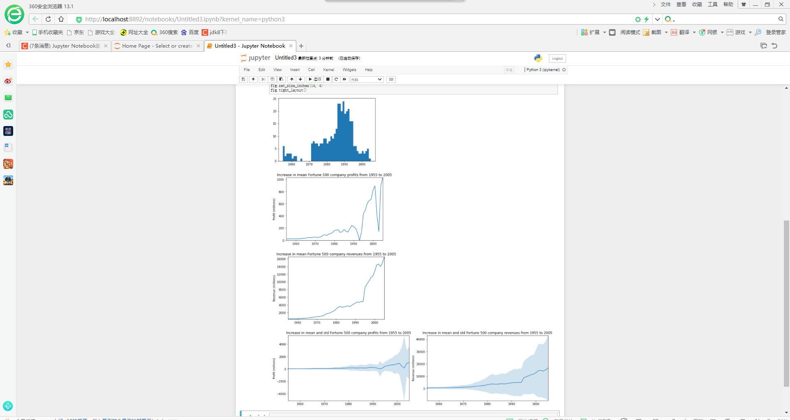
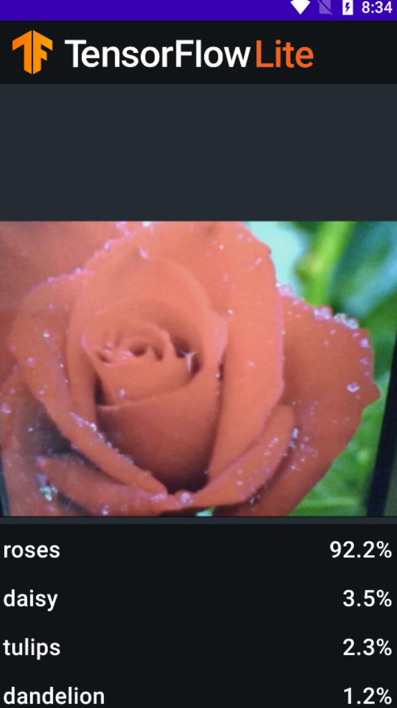

**所有实验均在此md！**

# 实验一



Jupyter NoteBook的安装
1.在官网https://www.anaconda.com/products/distribution点击下载



2.完成下载之后，双击下载文件，启动安装程序。
注意：
① 如果在安装过程中遇到任何问题，那么暂时地关闭杀毒软件，并在安装程序完成之后再打开。

② 如果在安装时选择了“为所有用户安装”，则卸载Anaconda然后重新安装，只为“我这个用户”安装。
3.选择"next"。

4. 阅读许可证协议条款，然后勾选“I Agree”并进行下一步。
5. 除非是以管理员身份为所有用户安装，否则仅勾选“Just Me”并点击“Next”。
6. 在“Choose Install Location”界面中选择安装Anaconda的目标路径，然后点击“Next”。
   注意：
   ① 目标路径中不能含有空格，同时不能是“unicode”编码。

② 除非被要求以管理员权限安装，否则不要以管理员身份安装。

7.一直点next就可以了


8.验证是否安装成功

① “开始 → Anaconda3（64-bit）→ Anaconda Navigator”，若可以成功启动Anaconda Navigator则说明安装成功。

② “开始 → Anaconda3（64-bit）→ 右键点击Anaconda Prompt → 以管理员身份运行”，在Anaconda Prompt中输入 conda list ，可以查看已经安装的包名和版本号。若结果可以正常显示，则说明安装成功。

9在安装成功后点击界面中的Notebook就可以跳转到http://localhost:8888/tree#notebooks

10可以new一个python就可以开始写代码了



# 实验二

创建一个新工程



运行新程序



修改fragment

```
<?xml version="1.0" encoding="utf-8"?>  
<androidx.constraintlayout.widget.ConstraintLayout xmlns:android="http://schemas.android.com/apk/res/android"  
  xmlns:app="http://schemas.android.com/apk/res-auto"  
  xmlns:tools="http://schemas.android.com/tools"  
  android:layout_width="match_parent"  
  android:layout_height="match_parent"  
  android:background="@color/screenBackground"  
  tools:context=".FirstFragment">  

 <TextView  android:id="@+id/textview_first"  
  android:layout_width="wrap_content"  
  android:layout_height="wrap_content"  
  android:fontFamily="sans-serif-condensed"  
  android:text="@string/hello_first_fragment"  
  android:textColor="@android:color/white"  
  android:textSize="72sp"  
  android:textStyle="bold"  
  app:layout_constraintBottom_toBottomOf="parent"  
  app:layout_constraintEnd_toEndOf="parent"  
  app:layout_constraintStart_toStartOf="parent"  
  app:layout_constraintTop_toTopOf="parent"  
  app:layout_constraintVertical_bias="0.3" />  

 <Button  android:id="@+id/random_button"  
  android:layout_width="wrap_content"  
  android:layout_height="wrap_content"  
  android:layout_marginEnd="24dp"  
  android:background="@color/buttonBackground"  
  android:text="@string/random_button_text"  
  app:layout_constraintBottom_toBottomOf="parent"  
  app:layout_constraintEnd_toEndOf="parent"  
  app:layout_constraintTop_toBottomOf="@+id/textview_first" />  

 <Button  android:id="@+id/toast_button"  
  android:layout_width="wrap_content"  
  android:layout_height="wrap_content"  
  android:layout_marginStart="24dp"  
  android:background="@color/buttonBackground"  
  android:text="@string/toast_button_text"  
  app:layout_constraintBottom_toBottomOf="parent"  
  app:layout_constraintStart_toStartOf="parent"  
  app:layout_constraintTop_toBottomOf="@+id/textview_first" />  

 <Button  android:id="@+id/count_button"  
  android:layout_width="wrap_content"  
  android:layout_height="wrap_content"  
  android:text="@string/count_button_text"  
  android:background="@color/buttonBackground"  
  app:layout_constraintBottom_toBottomOf="parent"  
  app:layout_constraintEnd_toStartOf="@+id/random_button"  
  app:layout_constraintStart_toEndOf="@+id/toast_button"  
  app:layout_constraintTop_toBottomOf="@+id/textview_first" />  
</androidx.constraintlayout.widget.ConstraintLayout>
```



修改第二个fragment

```
<?xml version="1.0" encoding="utf-8"?>
<androidx.constraintlayout.widget.ConstraintLayout xmlns:android="http://schemas.android.com/apk/res/android"
    xmlns:app="http://schemas.android.com/apk/res-auto"
    xmlns:tools="http://schemas.android.com/tools"
    android:layout_width="match_parent"
    android:layout_height="match_parent"
    android:background="@color/screenBackground"
    tools:context=".SecondFragment">

    <TextView
        android:id="@+id/textview_header"
        android:layout_width="match_parent"
        android:layout_height="wrap_content"
        android:layout_marginStart="24dp"
        android:layout_marginTop="24dp"
        android:layout_marginEnd="24dp"
        android:textColor="@color/colorPrimaryDark"
        android:text="@string/random_heading"
        android:textSize="24sp"
        app:layout_constraintEnd_toEndOf="parent"
        app:layout_constraintStart_toStartOf="parent"
        app:layout_constraintTop_toTopOf="parent" />

    <Button
        android:id="@+id/button_second"
        android:layout_width="wrap_content"
        android:layout_height="wrap_content"
        android:text="@string/previous"
        app:layout_constraintBottom_toBottomOf="parent"
        app:layout_constraintEnd_toEndOf="parent"
        app:layout_constraintStart_toStartOf="parent" />

    <TextView
        android:id="@+id/textView_random"
        android:layout_width="wrap_content"
        android:layout_height="wrap_content"
        android:textColor="@color/white"
        android:text="R"
        android:textSize="72sp"
        android:textStyle="bold"
        app:layout_constraintBottom_toTopOf="@+id/button_second"
        app:layout_constraintEnd_toEndOf="parent"
        app:layout_constraintStart_toStartOf="parent"
        app:layout_constraintTop_toBottomOf="@+id/textview_header"
        app:layout_constraintVertical_bias="0.45" />
</androidx.constraintlayout.widget.ConstraintLayout>
```

切换效果





# 实验三

补全代码

```
 // TODO 5: Optional GPU Delegates
    implementation 'org.tensorflow:tensorflow-lite-gpu:2.3.0'
```

```
override fun analyze(imageProxy: ImageProxy) {

            val items = mutableListOf<Recognition>()
            // TODO 2: Convert Image to Bitmap then to TensorImage
            val tfImage = TensorImage.fromBitmap(toBitmap(imageProxy))

            // TODO 3: Process the image using the trained model, sort and pick out the top results
            val outputs = flowerModel.process(tfImage)
                .probabilityAsCategoryList.apply {
                    sortByDescending { it.score } // Sort with highest confidence first排序
                }.take(MAX_RESULT_DISPLAY) // take the top results
            // TODO 4: Converting the top probability items into a list of recognitions
            for (output in outputs) {
                items.add(Recognition(output.label, output.score))
            }
```

实验结果


# 实验四

历年财富世界500强的数据分析

%matplotlib inline
import pandas as pd
import matplotlib.pyplot as plt
import seaborn as sns

df = pd.read_csv('fortune500.csv')
df.head()
df.tail()

df.columns = ['year', 'rank', 'company', 'revenue', 'profit']
len(df)

df.dtypes

non_numberic_profits = df.profit.str.contains('[^0-9.-]')
df.loc[non_numberic_profits].head()

len(df.profit[non_numberic_profits])

bin_sizes, _, _ = plt.hist(df.year[non_numberic_profits], bins=range(1955, 2006))

df = df.loc[~non_numberic_profits]
df.profit = df.profit.apply(pd.to_numeric)

len(df)

df.dtypes

group_by_year = df.loc[:, ['year', 'revenue', 'profit']].groupby('year')
avgs = group_by_year.mean()
x = avgs.index
y1 = avgs.profit
def plot(x, y, ax, title, y_label):
    ax.set_title(title)
    ax.set_ylabel(y_label)
    ax.plot(x, y)
    ax.margins(x=0, y=0)

fig, ax = plt.subplots()
plot(x, y1, ax, 'Increase in mean Fortune 500 company profits from 1955 to 2005', 'Profit (millions)')

y2 = avgs.revenue
fig, ax = plt.subplots()
plot(x, y2, ax, 'Increase in mean Fortune 500 company revenues from 1955 to 2005', 'Revenue (millions)')

def plot_with_std(x, y, stds, ax, title, y_label):
    ax.fill_between(x, y - stds, y + stds, alpha=0.2)
    plot(x, y, ax, title, y_label)
fig, (ax1, ax2) = plt.subplots(ncols=2)
title = 'Increase in mean and std Fortune 500 company %s from 1955 to 2005'
stds1 = group_by_year.std().profit.values
stds2 = group_by_year.std().revenue.values
plot_with_std(x, y1.values, stds1, ax1, title % 'profits', 'Profit (millions)')
plot_with_std(x, y2.values, stds2, ax2, title % 'revenues', 'Revenue (millions)')
fig.set_size_inches(14, 4)
fig.tight_layout()

实验结果




# 实验五

### 模型训练

#### 获取数据

从 `storage.googleapis.com`中下载本实验所需要的数据集。`image_path`可以定制，默认是在用户目录的 `.keras\datasets`中。

```
image_path = tf.keras.utils.get_file(
      'flower_photos.tgz',
      'https://storage.googleapis.com/download.tensorflow.org/example_images/flower_photos.tgz',
      extract=True)
image_path = os.path.join(os.path.dirname(image_path), 'flower_photos')
```

```
Downloading data from https://storage.googleapis.com/download.tensorflow.org/example_images/flower_photos.tgz
228813984/228813984 [==============================] - 251s 1us/step
```

#### 运行示例

第一步：加载数据集，并将数据集分为训练数据和测试数据。

```
data = DataLoader.from_folder(image_path)
train_data, test_data = data.split(0.9)
```

```
INFO:tensorflow:Load image with size: 3670, num_label: 5, labels: daisy, dandelion, roses, sunflowers, tulips.
```

第二步：训练Tensorflow模型。

```
inception_v3_spec = image_classifier.ModelSpec(uri='https://storage.googleapis.com/tfhub-modules/tensorflow/efficientnet/lite0/feature-vector/2.tar.gz')
inception_v3_spec.input_image_shape = [240, 240]
model = image_classifier.create(train_data, model_spec=inception_v3_spec)
```

```
INFO:tensorflow:Retraining the models...


INFO:tensorflow:Retraining the models...


Model: "sequential"
_________________________________________________________________
 Layer (type)                Output Shape              Param #   
=================================================================
 hub_keras_layer_v1v2 (HubKe  (None, 1280)             3413024   
 rasLayerV1V2)                                                 

 dropout (Dropout)           (None, 1280)              0       

 dense (Dense)               (None, 5)                 6405    

=================================================================
Total params: 3,419,429
Trainable params: 6,405
Non-trainable params: 3,413,024
_________________________________________________________________
None
Epoch 1/5


D:\IT\Anaconda3\lib\site-packages\keras\optimizers\optimizer_v2\gradient_descent.py:108: UserWarning: The `lr` argument is deprecated, use `learning_rate` instead.
  super(SGD, self).__init__(name, **kwargs)


103/103 [==============================] - 45s 420ms/step - loss: 0.8842 - accuracy: 0.7624
Epoch 2/5
103/103 [==============================] - 44s 425ms/step - loss: 0.6595 - accuracy: 0.8917
Epoch 3/5
103/103 [==============================] - 43s 421ms/step - loss: 0.6290 - accuracy: 0.9154
Epoch 4/5
103/103 [==============================] - 44s 429ms/step - loss: 0.6047 - accuracy: 0.9235
Epoch 5/5
103/103 [==============================] - 44s 428ms/step - loss: 0.5916 - accuracy: 0.9326
```

第三步：评估模型。

```
loss, accuracy = model.evaluate(test_data)
```

```
12/12 [==============================] - 6s 385ms/step - loss: 0.6264 - accuracy: 0.9128
```

第四步，导出Tensorflow Lite模型。

```
model.export(export_dir='.')
```

```
INFO:tensorflow:Assets written to: D:\Temp\tmpws0wzwmz\assets


INFO:tensorflow:Assets written to: D:\Temp\tmpws0wzwmz\assets
D:\IT\Anaconda3\lib\site-packages\tensorflow\lite\python\convert.py:766: UserWarning: Statistics for quantized inputs were expected, but not specified; continuing anyway.
  warnings.warn("Statistics for quantized inputs were expected, but not "


INFO:tensorflow:Label file is inside the TFLite model with metadata.


INFO:tensorflow:Label file is inside the TFLite model with metadata.


INFO:tensorflow:Saving labels in D:\Temp\tmpk91_ail8\labels.txt


INFO:tensorflow:Saving labels in D:\Temp\tmpk91_ail8\labels.txt


INFO:tensorflow:TensorFlow Lite model exported successfully: .\model.tflite


INFO:tensorflow:TensorFlow Lite model exported successfully: .\model.tflite
```


